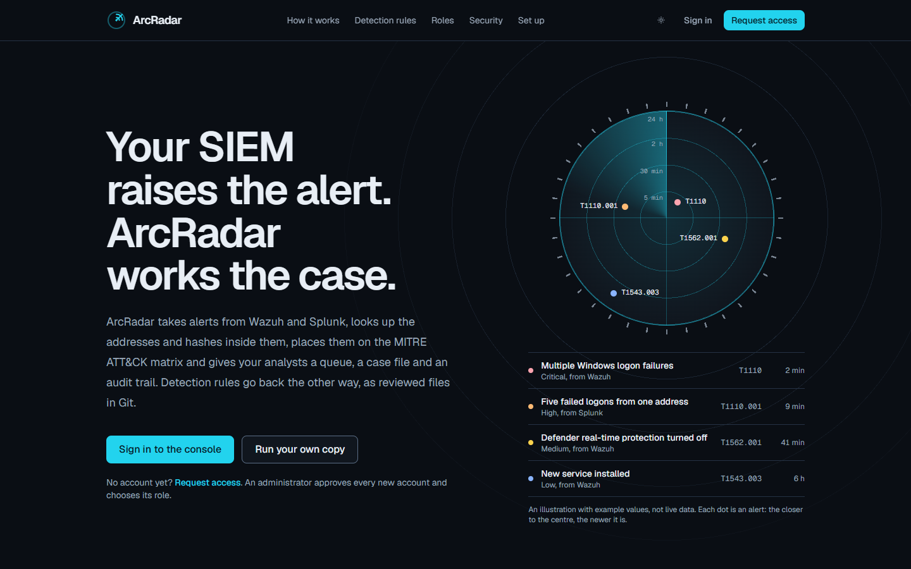
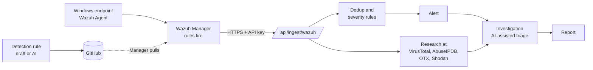
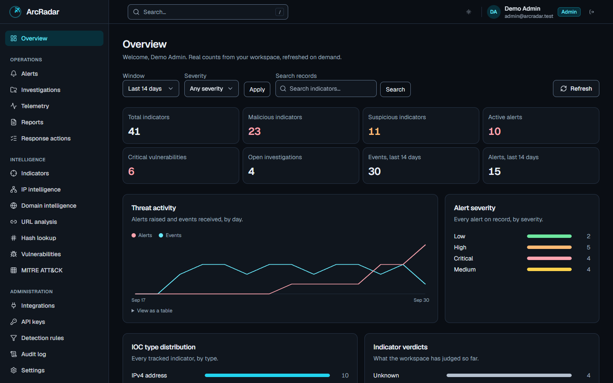
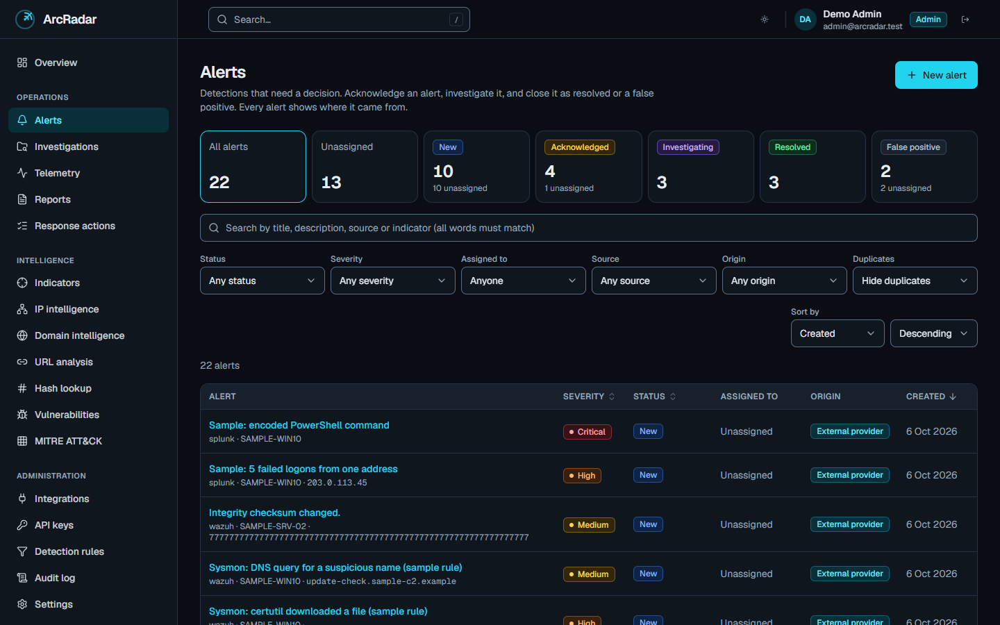

<div align="center">

# ArcRadar

**Incident response and threat monitoring that sits beside your SIEM.**
Real endpoint telemetry in, researched and mapped to MITRE ATT&CK, triaged with AI assistance, tracked to closure. Everything is role-gated and audited, and nothing runs on its own.

[](https://arcradar.vercel.app)
[](https://github.com/aqsin1337/ArcRadar/actions/workflows/ci.yml)




</div>

ArcRadar is a Holberton portfolio project. It is built around a real pipeline: a Windows 10 machine runs
a Wazuh Agent, a Wazuh Manager pushes alerts over HTTPS, and ArcRadar stores them, researches the
indicators inside, maps them to MITRE ATT&CK and gives an analyst the tools to triage and close them.
Every decision behind it is written down in [`docs/ARCRADAR_PROGRESS.md`](docs/ARCRADAR_PROGRESS.md).

**Try it:** [arcradar.vercel.app](https://arcradar.vercel.app). New accounts start as read-only viewers.

## How data flows



## Screenshots

| Overview                               | Alerts                            |
| -------------------------------------- | --------------------------------- |
|  |  |

The screenshots show the local demo dataset, so every record carries a **Demo data** label.

## What it does

- **Alerts and investigations.** Alerts follow a real lifecycle (new, acknowledged or investigating,
  then resolved or false positive) with concurrency-safe status changes. A repeated alert links to its
  primary instead of opening a fresh row, and admin-curated severity rules can raise (never lower) an
  alert's severity. An investigation is the case file: notes, evidence, a server-written history and an
  AI-assisted checklist.
- **Real telemetry.** A Wazuh Manager pushes alerts to `POST /api/ingest/wazuh` with a scoped, hashed
  API key. ArcRadar never polls a sensor and never stores Wazuh credentials
  ([`docs/WAZUH_INTEGRATION.md`](docs/WAZUH_INTEGRATION.md)).
- **Research on arrival.** Public indicators in a new alert are checked at VirusTotal, AbuseIPDB,
  AlienVault OTX and Shodan InternetDB. Private and reserved addresses never leave the workspace.
  Free public feeds (abuse.ch, CISA KEV) can be imported by an admin with one button.
- **MITRE ATT&CK matrix.** The techniques your own alerts named, by tactic in attack order, colored by
  worst severity. A click opens the alerts behind a technique.
- **Detection rules as code.** Describe what to catch, or write it by hand. ArcRadar renders the Wazuh
  rule XML itself (so an active response can never be in it), you review it, and it is committed to a
  Git repository. The Manager pulls approved rules on a schedule and installs only files that pass
  `wazuh-analysisd -t`. ArcRadar never reaches into the Manager
  ([`docs/WAZUH_RULES.md`](docs/WAZUH_RULES.md)).
- **AI, governed and not automated.** Groq, OpenAI, Anthropic, DeepSeek or a local Ollama can produce a
  threat summary, an ATT&CK mapping, a severity check, a false-positive score, response actions, a
  checklist or a verdict recommendation. Each answer is validated against a schema, stored immutably,
  labelled "AI-generated, analyst-assisted" and audited. It recommends and tracks. It never executes.
- **Indicators and lookups.** IPs, domains, URLs and hashes with verdict, confidence and tags, plus a
  vulnerability catalog. Every record carries its provenance (`demo`, `local` or `external`).
- **Reports, dashboard, administration.** Point-in-time report snapshots, a dashboard of true counts,
  API-key management, per-provider switches, user roles and a full audit log.

## Engineering highlights

- **Authorization lives in the database.** Roles, permission keys and row-level security policies are
  the source of truth. The app-side RBAC mirror is checked against drift by its own test.
- **Provenance is enforced, not displayed.** Clients can only create `local` records, and the database
  blocks relabelling, so demo data can never pass as intelligence.
- **Append-only audit log.** Even the service role cannot rewrite it.
- **Hardened by default.** Nonce-based CSP with no `unsafe-inline`, `httpOnly` and `secure` cookies, HSTS,
  a Postgres-backed shared rate limiter, and a reviewed outbound HTTP path (fixed HTTPS bases, no
  redirects, deadlines, size caps).
- **Runs on Vercel.** No always-on server, no in-memory state between requests, no background worker.
  Deduplication and rate limiting run inline on the request that needs them.
- **Tested at every layer.** Vitest, SQL security tests (mutation-checked), API smoke tests and
  Playwright E2E with an axe accessibility pass, plus a WCAG contrast checker for the design tokens.

## Stack

Next.js 16 (App Router, `src/` layout), TypeScript, Tailwind 4, Supabase (Postgres and Auth), Zod,
Vitest and Playwright. Production target: Vercel and Supabase.

## Getting started

```bash
npm install
npm run db:start   # local Supabase in Docker; first run downloads a few GB
npm run db:reset   # applies supabase/migrations and the demo seed
npm run db:env     # writes the local Supabase URL and keys into .env.local
npm run dev        # http://localhost:3000
```

Full walkthrough, demo accounts and troubleshooting: [`docs/LOCAL_DEVELOPMENT.md`](docs/LOCAL_DEVELOPMENT.md).
Deploying your own copy to Vercel and Supabase: [`docs/DEPLOYMENT.md`](docs/DEPLOYMENT.md).

## Testing

```bash
npm run lint && npm run typecheck && npm run test   # ESLint, tsc, Vitest (850+ tests)
npm run db:test                                      # SQL security and constraint tests (stack running)
npm run api:smoke                                    # end-to-end API checks (app and stack running)
npm run e2e                                          # Playwright in real Chrome, incl. an axe pass
npm run check:contrast                               # WCAG contrast of the design tokens
```

## Architecture in short

- **Layers:** Route Handler, auth and permission guard, Zod validation, service, then repository
  (Supabase) or provider adapter. Three route wrappers (`publicRoute`, `protectedRoute`, and
  `ingestRoute` for machines) do the same-origin check, guards, rate limiting and error mapping.
  Every endpoint: [`docs/API.md`](docs/API.md).
- **Provider abstractions.** Intelligence lookups, telemetry ingestion and AI calls each sit behind one
  interface with a demo or no-op default, and each family has exactly one outbound HTTP path.
- **Deep dives:** [`docs/TELEMETRY_ARCHITECTURE.md`](docs/TELEMETRY_ARCHITECTURE.md),
  [`docs/WAZUH_INTEGRATION.md`](docs/WAZUH_INTEGRATION.md),
  [`docs/WAZUH_RULES.md`](docs/WAZUH_RULES.md),
  [`docs/AI_AND_ORCHESTRATION_ARCHITECTURE.md`](docs/AI_AND_ORCHESTRATION_ARCHITECTURE.md).

## Security

Authorization is enforced in row-level security, not only in the app. API keys are stored as a hash and
shown once. Secrets stay server-only and are never in the client bundle. See
[`SECURITY.md`](SECURITY.md) for how to report a problem. This is a portfolio project, not a security
boundary anyone should rely on as-is.
