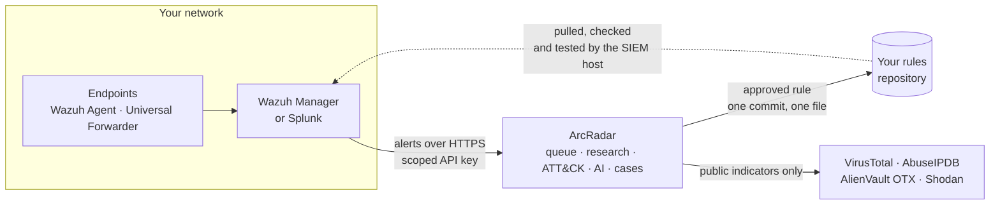
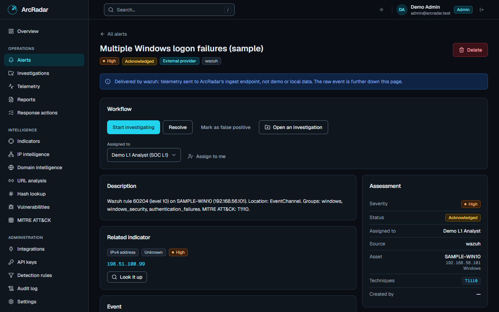
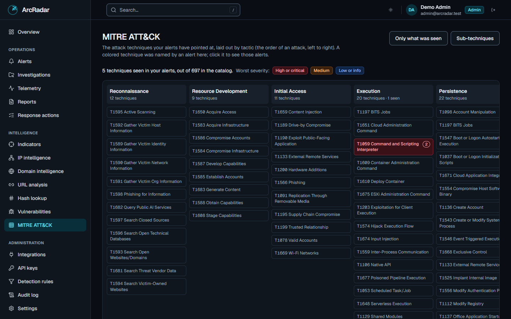
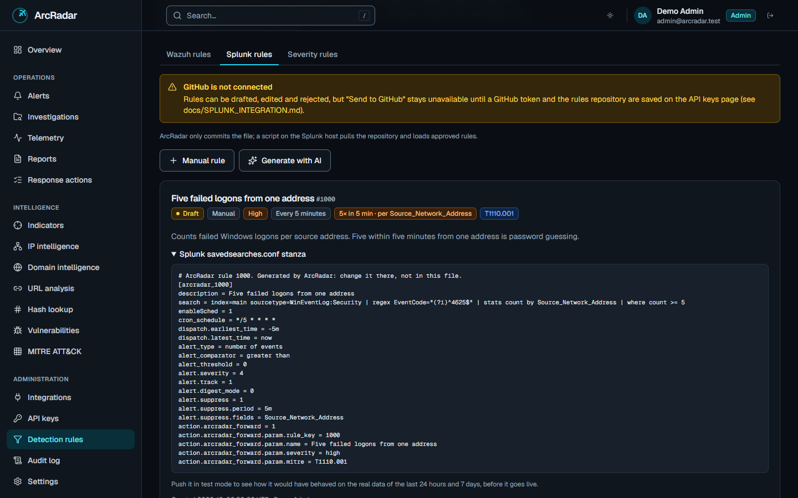
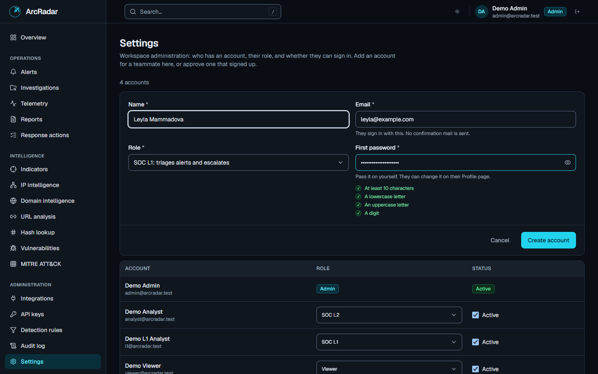
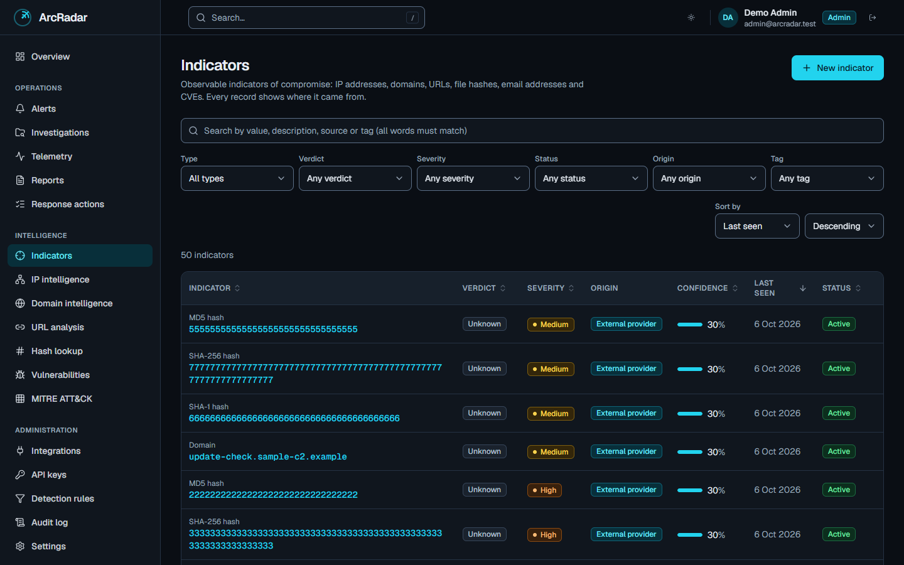
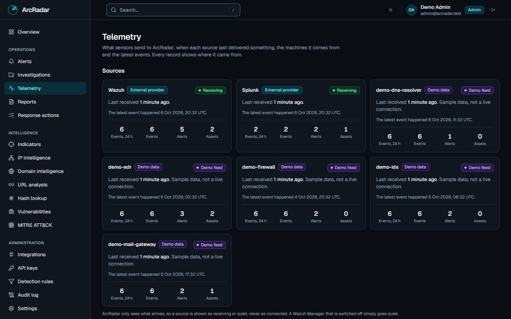

<div align="center">


# ArcRadar

**Your SIEM raises the alert. ArcRadar works the case.**

ArcRadar takes alerts from Wazuh and Splunk, researches what is inside them, places them on the
MITRE ATT&CK matrix and gives analysts a queue, a case file and an audit trail.<br>
Detection rules go back the other way, as reviewed files in Git.

[](https://arcradar.vercel.app)
[](https://github.com/aqsin1337/ArcRadar/actions/workflows/ci.yml)


[**Open the live app**](https://arcradar.vercel.app) &nbsp;·&nbsp; [**Quick start**](#quick-start) &nbsp;·&nbsp; [**Connect a SIEM**](#connect-your-siem) &nbsp;·&nbsp; [**Documentation**](#documentation)


</div>

## What it is

A SIEM is good at one thing: deciding that something happened. What comes next is usually a mess of
browser tabs, spreadsheets and chat messages. Who is this address? Is it the same alert as an hour ago?
Who is looking at it? What did we do last time?

ArcRadar is the place where that work happens. It sits **beside** your SIEM, not inside it:

- **Alerts come in.** A Wazuh Manager or a Splunk server sends each alert over HTTPS. ArcRadar
  de-duplicates it, looks up the public indicators at threat-intelligence sources, maps it to MITRE
  ATT&CK and puts it in a queue with an owner and a status.
- **Cases get worked.** An analyst triages the alert, asks an AI model for a summary or a second
  opinion, opens an investigation, ticks off response steps and writes the report.
- **Rules go back out.** Write a detection rule in ArcRadar, or describe it in a sentence. ArcRadar
  writes the Wazuh or Splunk rule file, you read it and test it on real logs, and it is committed to
  your Git repository. The SIEM picks it up from there.

ArcRadar never logs in to your SIEM and never runs anything on a machine. It recommends, records and
keeps the trail.

## How it works



Every arrow that touches your network starts **inside** it. There is no inbound firewall rule to
write, and ArcRadar holds no SIEM password that could leak.

## A look inside

|                                                                           |                                                                               |
| ------------------------------------------------------------------------- | ----------------------------------------------------------------------------- |
| **Overview.** Real counts, what is open, which techniques were seen most. | **Alerts.** One queue for every source, with severity, owner and status.      |
|                                     |                                              |
| **An alert.** The machine, the indicators, the technique, the timeline.   | **ATT&CK matrix.** Built from your own alerts. Click a technique to see them. |
|                                         |                                  |
| **Detection rules.** The exact file a rule becomes, before it is sent.    | **Team.** Four roles. Add an account, or approve one that signed up.          |
|                                  |                                          |
| **Indicators.** Verdict, confidence, tags and where each one came from.   | **Telemetry.** When each source last sent something. Never "connected".       |
|                                  |                                        |

The screenshots show a local demonstration dataset. In the app every record carries a label that says
whether it is demo data, typed in by your team, or arrived from an outside source.

## What you get

**Alerts and cases**

- One queue for alerts from every source, with a lifecycle (new, acknowledged, investigating, resolved
  or false positive) and an owner.
- A repeat of the same alert within an hour links to the first one instead of filling the queue.
- Severity rules you write can raise the severity of matching alerts. They can never lower it.
- Investigations hold the alerts, indicators, notes, evidence and a checklist for one incident, with a
  history written by the server.
- Reports are snapshots: generated once, kept as they were, ready to print.

**Intelligence**

- Indicators (addresses, domains, URLs, file hashes) with a verdict, a confidence and tags.
- Lookups at VirusTotal, AbuseIPDB, AlienVault OTX and Shodan InternetDB. New indicators in an alert are
  researched as they arrive. Private and reserved addresses are never sent anywhere.
- Public feeds on demand: abuse.ch (URLhaus, Feodo Tracker, ThreatFox) and CISA's known exploited
  vulnerabilities.
- A MITRE ATT&CK matrix built from the techniques your own alerts named, coloured by the worst alert
  behind each one.

**Detection rules as code**

- Rules for **Wazuh** and **Splunk**, written as a form or drafted by AI from a sentence.
- ArcRadar generates the file itself from the fields, so a rule can contain a search and nothing else:
  no command, no response action, no extra stage. The script on the SIEM host checks every file again
  before loading it.
- For Splunk: the form offers the indexes, sourcetypes and fields your server really has. Push a rule in
  **test mode** and Splunk reports how often it would have fired over the last 24 hours and 7 days of
  real logs. Then go live, or **withdraw** it and the SIEM drops it.
- Rules travel through a Git repository you own. A rule pushed in ArcRadar is installed and tested on
  Splunk about fifteen seconds later.

**AI assistance, under control**

- Seven kinds of analysis: threat summary, ATT&CK mapping, severity check, false-positive score,
  response actions, investigation checklist and verdict recommendation.
- Works with Groq, OpenAI, Anthropic, DeepSeek or a local Ollama. An administrator picks one.
- Every answer is checked against a schema, stored unchanged, labelled as AI-generated and written to
  the audit log. It never changes a record by itself.

**Team and administration**

- Four roles: Admin, SOC L2, SOC L1 and Viewer. A new account can do nothing until an administrator
  approves it.
- Scoped API keys for the machines that send data. Only a hash is stored.
- Provider keys are pasted inside the app and encrypted before they are stored.
- A full audit log that cannot be edited, even by the service account.

## Quick start

This is the short path to an ArcRadar of your own on the free plans of Supabase and Vercel. Each step
has more detail, and a troubleshooting table, in the [deployment guide](docs/DEPLOYMENT.md).

You need a GitHub, a Supabase and a Vercel account, and git and Node.js 20.19 or newer on your computer
(used once, to create the database).

**1. Create the database.** Make a new project on [supabase.com](https://supabase.com), then send the
schema to it:

```bash
git clone https://github.com/aqsin1337/ArcRadar.git
cd ArcRadar
npm install
npx supabase login
npx supabase link --project-ref <your-project-ref>
npx supabase db push
```

**2. Set the sign-in rules.** In Supabase, under **Authentication**, set the Site URL to the address
your app will have, and the password rule to 10 characters with lowercase, uppercase and digits
([details](docs/DEPLOYMENT.md#2-set-the-sign-in-rules)).

**3. Deploy the app.** Press the button and fill in the five settings it asks for
([what each one is](docs/DEPLOYMENT.md#3-deploy-the-app)).

[](https://vercel.com/new/clone?repository-url=https%3A%2F%2Fgithub.com%2Faqsin1337%2FArcRadar&env=NEXT_PUBLIC_SUPABASE_URL,NEXT_PUBLIC_SUPABASE_ANON_KEY,SUPABASE_SERVICE_ROLE_KEY,NEXT_PUBLIC_APP_URL,SECRETS_ENCRYPTION_KEY&envDescription=The%20three%20Supabase%20values%20from%20step%201%2C%20the%20address%20of%20this%20deployment%2C%20and%2032%20random%20bytes%20in%20base64.&envLink=https%3A%2F%2Fgithub.com%2Faqsin1337%2FArcRadar%2Fblob%2Fmain%2Fdocs%2FDEPLOYMENT.md%233-deploy-the-app&project-name=arcradar&repository-name=arcradar)

**4. Make yourself the administrator.** Open your app, choose **Request access** and sign up. Then, in
the Supabase **SQL Editor**, run this once with your email:

```sql
update public.profiles
set role_name = 'admin', is_active = true
where id = (select id from auth.users where email = 'you@example.com');
```

**5. Sign in and add your team.** In **Settings**, press **Add account** for each analyst and choose
their role. Check `https://<your-app>/api/health`: it should say `"status": "ok"`.

**6. Connect a SIEM.** See [below](#connect-your-siem).

## Configuration

### Required settings

Set in Vercel under **Settings > Environment Variables**.

| Setting                         | What it is                                                                 |
| ------------------------------- | -------------------------------------------------------------------------- |
| `NEXT_PUBLIC_SUPABASE_URL`      | Your Supabase project URL                                                  |
| `NEXT_PUBLIC_SUPABASE_ANON_KEY` | The project's `anon` key. Public by design: the database enforces access   |
| `SUPABASE_SERVICE_ROLE_KEY`     | The project's `service_role` key. A secret: it bypasses every access check |
| `NEXT_PUBLIC_APP_URL`           | The public address of your deployment, used in sign-in and reset links     |

### Recommended

| Setting                  | What it is                                                                                                                             |
| ------------------------ | -------------------------------------------------------------------------------------------------------------------------------------- |
| `SECRETS_ENCRYPTION_KEY` | 32 random bytes in base64 (`openssl rand -base64 32`). Lets an administrator paste the keys below inside the app instead of in Vercel. |

### Everything else is set inside the app

With `SECRETS_ENCRYPTION_KEY` in place, an administrator opens **API keys > Keys ArcRadar uses**, pastes
a key and it works at once. Keys are encrypted with AES-256-GCM and never shown again. Each of these can
also be set as an environment variable with the name in the last column; a key saved in the app wins.

| What                       | Switches on                                                | Environment variable                                                      |
| -------------------------- | ---------------------------------------------------------- | ------------------------------------------------------------------------- |
| VirusTotal key             | Lookups of addresses, domains, URLs and hashes             | `VIRUSTOTAL_API_KEY`                                                      |
| AbuseIPDB key              | Reputation of IP addresses                                 | `ABUSEIPDB_API_KEY`                                                       |
| AlienVault OTX key         | Community threat reports                                   | `OTX_API_KEY`                                                             |
| Shodan InternetDB (switch) | Open ports and known vulnerabilities of an address. No key | `SHODAN_INTERNETDB=true`                                                  |
| NVD key                    | Importing a CVE into the vulnerability list                | `NVD_API_KEY`                                                             |
| AI provider key            | AI analysis and AI rule drafts                             | `GROQ_API_KEY`, `OPENAI_API_KEY`, `ANTHROPIC_API_KEY`, `DEEPSEEK_API_KEY` |
| Rules repository           | Sending detection rules to GitHub                          | `GITHUB_TOKEN`, `GITHUB_RULES_REPO`, `GITHUB_RULES_BRANCH`                |
| Local AI model             | Ollama. Environment variable only, by design               | `OLLAMA_BASE_URL`                                                         |

Other things an administrator sets in the app:

| Where               | What                                                                                 |
| ------------------- | ------------------------------------------------------------------------------------ |
| **Integrations**    | Switch any provider on or off, choose the active AI provider and model, import feeds |
| **API keys**        | Make and revoke the keys your SIEM uses to send alerts                               |
| **Settings**        | Add accounts, approve sign-ups, change roles, disable an account                     |
| **Detection rules** | Wazuh rules, Splunk rules, and severity rules that run inside ArcRadar               |

ArcRadar starts with none of the optional keys and still works: lookups then answer from a small,
clearly labelled demo dataset, and the AI buttons stay hidden.

## Connect your SIEM

In both cases the SIEM pushes to ArcRadar. First make a key: in the app open **API keys**, press
**New key** and choose the scope for your SIEM. It is shown once.

### Wazuh

1. Copy [`deploy/wazuh/custom-arcradar`](deploy/wazuh/custom-arcradar) to the Manager:

   ```sh
   sudo install -o root -g wazuh -m 750 custom-arcradar /var/ossec/integrations/custom-arcradar
   ```

2. Add this inside `<ossec_config>` in `/var/ossec/etc/ossec.conf`, with your address and key:

   ```xml
   <integration>
     <name>custom-arcradar</name>
     <hook_url>https://YOUR-APP/api/ingest/wazuh</hook_url>
     <api_key>arc_...</api_key>
     <level>7</level>
     <alert_format>json</alert_format>
   </integration>
   ```

3. `sudo systemctl restart wazuh-manager`, then open **Telemetry** in ArcRadar. The Wazuh card says
   **Receiving** when the first alert arrives.

Full guide, retry behaviour and troubleshooting: [`docs/WAZUH_INTEGRATION.md`](docs/WAZUH_INTEGRATION.md).

### Splunk

1. Copy the app [`deploy/splunk/app/arcradar_rules`](deploy/splunk/app/arcradar_rules) to
   `$SPLUNK_HOME/etc/apps/` on the Splunk server.
2. Tell it where ArcRadar is, in `$SPLUNK_HOME/etc/apps/arcradar_rules/local/arcradar_forward.json`
   (mode 600):

   ```json
   { "url": "https://YOUR-APP/api/ingest/splunk", "api_key": "arc_..." }
   ```

3. Restart Splunk. Any saved search can now use the alert action **arcradar_forward**, and every rule
   written in ArcRadar uses it automatically.

Full guide, including the field catalogue, test mode and the instant-delivery watcher:
[`docs/SPLUNK_INTEGRATION.md`](docs/SPLUNK_INTEGRATION.md).

### Detection rules through Git

1. Create a GitHub repository for your rules and a fine-grained token that can reach only that
   repository, with **Contents: Read and write**.
2. Save the token, the repository and the branch under **API keys > Keys ArcRadar uses**.
3. Install the apply script on the SIEM host. It pulls the repository, refuses any file that is not
   exactly what ArcRadar generates, lets the SIEM test it, and only then loads it:
   - Wazuh: [`deploy/wazuh/apply-arcradar-rules.sh`](deploy/wazuh/apply-arcradar-rules.sh),
     [guide](docs/WAZUH_RULES.md)
   - Splunk: [`deploy/splunk/apply-arcradar-rules.sh`](deploy/splunk/apply-arcradar-rules.sh),
     [guide](docs/SPLUNK_INTEGRATION.md)

## Roles

| A person can                                                        | Viewer | SOC L1 | SOC L2 | Admin |
| ------------------------------------------------------------------- | :----: | :----: | :----: | :---: |
| See alerts, cases, indicators, vulnerabilities and reports          |   ✓    |   ✓    |   ✓    |   ✓   |
| Acknowledge, assign and close alerts                                |        |   ✓    |   ✓    |   ✓   |
| Ask the AI for an analysis                                          |        |   ✓    |   ✓    |   ✓   |
| Open investigations, write indicators and reports                   |        |        |   ✓    |   ✓   |
| Run live lookups at intelligence sources                            |        |        |   ✓    |   ✓   |
| Write detection rules and send them to Git                          |        |        |        |   ✓   |
| Manage accounts, integrations and provider keys, read the audit log |        |        |        |   ✓   |

The roles are row-level security policies in Postgres, not only checks in the screens. A request that
skips the app and goes straight to the database gets the same answer.

## Security

- **Authorization lives in the database.** Every table has row-level security. The checks in the app
  are the fast path; Postgres has the last word.
- **An audit log nobody can edit.** Every write is recorded, and the table is append-only even for the
  service role.
- **Keys are stored the way passwords are.** An API key is kept as a hash, has one scope and an expiry,
  and is checked again on every request. Provider keys are encrypted before they are stored.
- **No inline scripts or styles.** A nonce-based Content-Security-Policy on every response, `HttpOnly`
  and `Secure` session cookies, and HSTS.
- **Rate limits** on sign-in, AI calls, alert creation and ingestion, kept in Postgres so they hold
  across serverless instances.
- **Outbound calls on a short leash.** Fixed HTTPS addresses, no redirects, a deadline and a size cap.
  Nothing a person types becomes a host name.
- **Labelled data.** Every record says whether it is demo data, typed in locally or from an outside
  source. The database enforces the label, so demo data can never pass as real intelligence.

Found a problem? See [`SECURITY.md`](SECURITY.md). ArcRadar is a portfolio project: review it before
you rely on it.

## Documentation

| Guide                                                                      | For                                                               |
| -------------------------------------------------------------------------- | ----------------------------------------------------------------- |
| [Deployment](docs/DEPLOYMENT.md)                                           | The full setup, step by step, with troubleshooting                |
| [Wazuh integration](docs/WAZUH_INTEGRATION.md)                             | Sending Wazuh alerts to ArcRadar                                  |
| [Wazuh rules](docs/WAZUH_RULES.md)                                         | Writing Wazuh rules in ArcRadar and delivering them through Git   |
| [Splunk integration](docs/SPLUNK_INTEGRATION.md)                           | Alerts in, rules out, the field catalogue, test mode, the watcher |
| [API reference](docs/API.md)                                               | Every endpoint, the response format and the error codes           |
| [Telemetry architecture](docs/TELEMETRY_ARCHITECTURE.md)                   | How ingestion is designed and why                                 |
| [AI and response orchestration](docs/AI_AND_ORCHESTRATION_ARCHITECTURE.md) | How AI is used, limited and recorded                              |
| [Local development](docs/LOCAL_DEVELOPMENT.md)                             | Running ArcRadar on your own machine, and the test suites         |

## Built with

Next.js 16 (App Router) and TypeScript, Tailwind CSS 4, Supabase (Postgres, Auth, row-level security)
and Zod, hosted on Vercel. Tested with Vitest, SQL tests against the database, API smoke tests and
Playwright with an accessibility pass. If you want to work on the code, start with
[`docs/LOCAL_DEVELOPMENT.md`](docs/LOCAL_DEVELOPMENT.md).

A Holberton School portfolio project.
